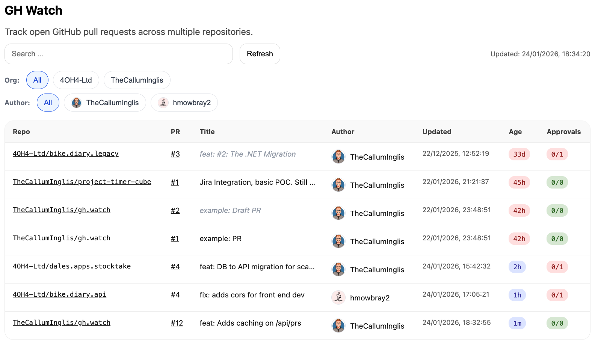

# gh.watch

Lightweight GitHub repository watcher built with Next.js / TypeScript. Designed for quick overview of active PRs across multiple organisations & repositories.



## Setup

### Environment Variables
- `GITHUB_TOKEN` (Required): GitHub Personal Access Token with `repo` and `read:org` scopes.

### Repo Configuration
The `assets/repos.yaml` file should be structured as follows:

```yaml
orgs:
- name: 4OH4-Ltd
  minReviews: 1
  repos:
    - bike.diary.customer
    - bike.diary.api
    - bike.diary.legacy

- name: TheCallumInglis
  minReviews: 0
  repos:
    - gh.watch
    - proxmox.k8s
    - project-timer-cube
```

Run with Node:
```bash
npm run dev
```

Run with Docker:
```bash
docker-compose up --build
```
